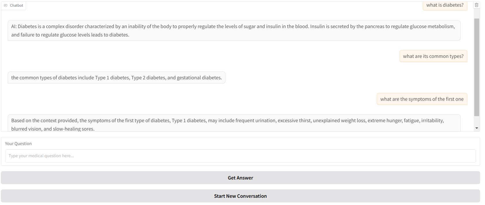

# Medical Chatbot Assistant

This **Medical Chatbot Assistant** is designed to provide insightful, context-aware responses to medical questions based on uploaded medical literature. Developed with [LangChain](https://www.langchain.com/), [OpenAI's API](https://openai.com/api/), and an interactive [Gradio](https://gradio.app/) interface, the chatbot leverages retrieval-augmented generation to retrieve relevant content and generate accurate answers. This project demonstrates practical applications of memory and multi-query capabilities to enhance response accuracy and relevance.

## What is RAG?
RAG is a technique for augmenting LLM knowledge with additional data.

LLMs can reason about wide-ranging topics, but their knowledge is limited to the public data up to a specific point in time that they were trained on. If you want to build AI applications that can reason about private data or data introduced after a model's cutoff date, you need to augment the knowledge of the model with the specific information it needs. The process of bringing and inserting appropriate information into the model prompt is known as Retrieval Augmented Generation (RAG).

## Project Highlights

- **Document-Aware Medical Assistance**: The chatbot scans uploaded medical documents, allowing users to ask questions and receive responses rooted in the provided material.
- **Retrieval-Augmented Generation (RAG)**: By integrating document retrieval and language generation, the assistant enhances answer quality and relevance.
- **Contextual Memory**: The chatbot retains memory within each session, allowing it to recall recent queries and responses for a more cohesive conversation.
- **Multi-Query Retrieval**: For complex queries, the chatbot automatically generates multiple sub-queries to retrieve a broader range of relevant information, synthesizing these results to provide a more comprehensive answer.
- **User-Friendly Interface**: Built with Gradio, the chatbot provides an accessible, interactive chat experience.

## Example Interaction

## Technology Stack

- **LangChain**: For seamless document handling, text splitting, memory management, and multi-query retrieval workflows.
- **OpenAI API**: Utilized for language model responses, embedding generation, and multi-query synthesis.
- **Gradio**: Provides a web-based interface to make the chatbot interactive and accessible.
